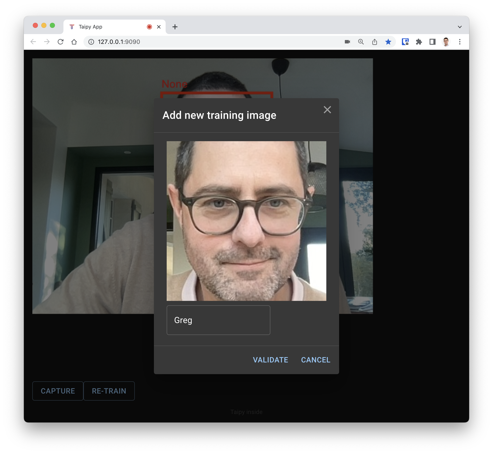

# Demo Face Recognition

## Usage
- [Usage](#usage)
- [What is Demo Face Recognition](#what-is-demo-face-recognition)
- [Directory Structure](#directory-structure)
- [License](#license)
- [Installation](#installation)
- [Contributing](#contributing)
- [Code of conduct](#code-of-conduct)

## What is Demo Face Recognition

This demo shows how to use Taipy with a custom GUI component to capture video from your webcam and do realtime face detection.

What this application demonstrates:
* How to build a complex custom UI component for Taipy.
* How to detect and recognize faces in the image in real time using OpenCV.

### How to use this Demo

First you need to install the dependencies and build the front-end. Please refer to [INSTALLATION.md](INSTALLATION.md).

Once you started the application, your default Web browser should open automatically. If not, open this URL: [http://127.0.0.1:9090](http://127.0.0.1:9090).
The browser should ask you for the authorization to use the camera. Press "Allow".

  

Once allowed, your camera should activate and you will see a live view of the video. Notice that your face your already be detected and the label "None" is displayed. This is because the application does not know you yet.

  

To train the app to recognize your face, press the "Capture" button. This will show a dialog with a captured image. Enter a name for that face and press "validate".
The more training examples, the better. So add few more captured images of your faces.

Notice that the case of the given name is important. So always use the same name for captured image.
Example: "Greg" and "greg" will be considered as two different names.

  

After say 6 different images, you can ask the system to learn from them by pressing the "Re-train" button.
Depending on the number of images to process, this can take from a second to a dozen of seconds.

The application will then be able to recognize the new face, and the name should be displayed on screen!

  

### Demo Type
- **Level**: Advanced
- **Topic**: Taipy-GUI, Computer Vision
- **Components/Controls**:
  - Taipy GUI: custom GUI component
- **Other**: OpenCV

## How to run

* This demo requires Python 3.9 or 3.10. Python 3.11 is currently not supported by Taipy.
* Python dependencies are defined in the provided `requirements.txt` file.
* To visualize images in Taipy, the package `python-magic` is required (as well as `python-magic-bin` on Windows). Please see the [python-magic](https://pypi.org/project/python-magic/) page for installation.

## Directory Structure
- `main.py`: Main file containing the demo application code.
- `demo/`: Contains additional demo source code.
  - `demo/faces.py`: Contains the code to do face detection and face recognition.
  - `src/image.py`: Contains shared facility functions.
- `webcam/`: Contains custom component code. The directory contains the Python files to declare the custom component to Taipy.
  - `webcam/webui`: Contains the TypeScript source code for the custom React component.
- `classifiers`: Contains the OpenCV classifiers used in the app for face detection.
- `images`: Contains the files to train the face detection of the demo. This folder is created at first startup. All image captures will go into this directory.
- `docs/`: contains the images for the documentation
- `CODE_OF_CONDUCT.md`: Code of conduct for members and contributors of _demo-covid-dashboard_.
- `CONTRIBUTING.md`: Instructions to contribute to _demo-covid-dashboard_.
- `INSTALLATION.md`: Instructions to install _demo-covid-dashboard_.
- `LICENSE`: The Apache 2.0 License.
- `Pipfile`: File used by the Pipenv virtual environment to manage project dependencies.
- `README.md`: Current file.

## License
Licensed under the Apache License, Version 2.0 (the "License"); you may not use this file except in compliance with the License. You may obtain a copy of the License at http://www.apache.org/licenses/LICENSE-2.0

Unless required by applicable law or agreed to in writing, software distributed under the License is distributed on an "AS IS" BASIS, WITHOUT WARRANTIES OR CONDITIONS OF ANY KIND, either express or implied. See the License for the specific language governing permissions and limitations under the License.

## Installation
Want to install this demo? Check out our [`INSTALLATION.md`](INSTALLATION.md) file.

## Contributing
Want to help build this demo? Check out our [`CONTRIBUTING.md`](CONTRIBUTING.md) file.

## Code of Conduct
Want to be part of the demo's community? Check out our [`CODE_OF_CONDUCT.md`](CODE_OF_CONDUCT.md) file.
