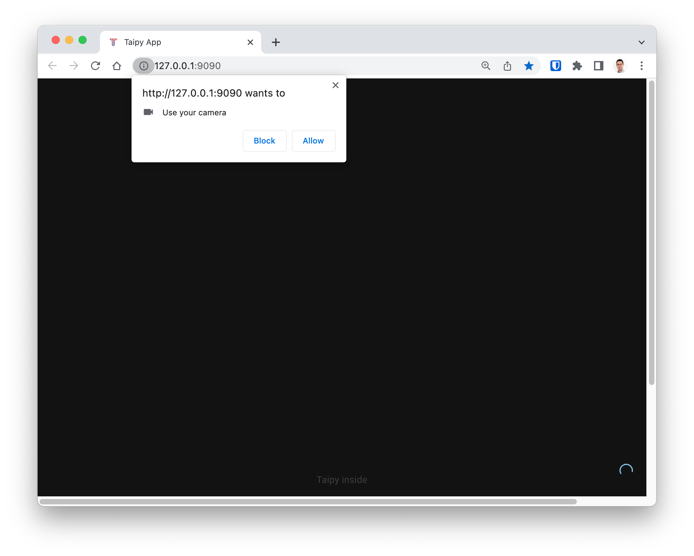
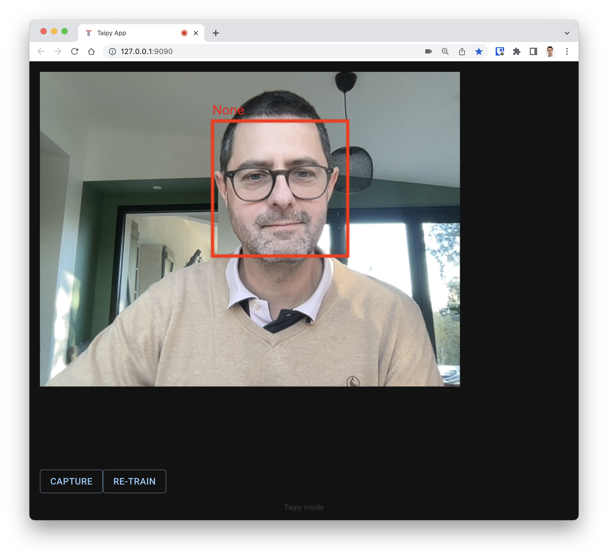
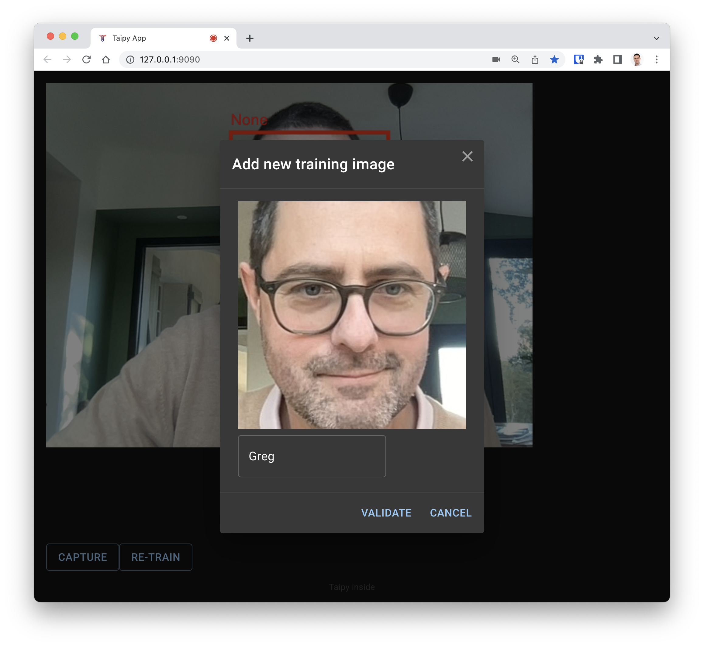

# Getting Started

## Installation
First you need to install the dependencies and build the front-end. Please refer to [INSTALLATION.md](INSTALLATION.md).

## How to use the demo

Once you started the application, your default Web browser should open automatically. If not, open this URL: [http://127.0.0.1:9090](http://127.0.0.1:9090).
The browser should ask you for the authorization to use the camera. Press "Allow".

  

Once allowed, your camera should activate and you will see a live view of the video. Notice that your face your already be detected and the label "None" is displayed. This is because the application does not know you yet.

  

To train the app to recognize your face, press the "Capture" button. This will show a dialog with a captured image. Enter a name for that face and press "validate".
The more training examples, the better. So add few more captured images of your faces.

Notice that the case of the given name is important. So always use the same name for captured image.
Example: "Greg" and "greg" will be considered as two different names.

  

After say 6 different images, you can ask the system to learn from them by pressing the "Re-train" button.
Depending on the number of images to process, this can take from a second to a dozen of seconds.

The application will then be able to recognize the new face, and the name should be displayed on screen!

  

